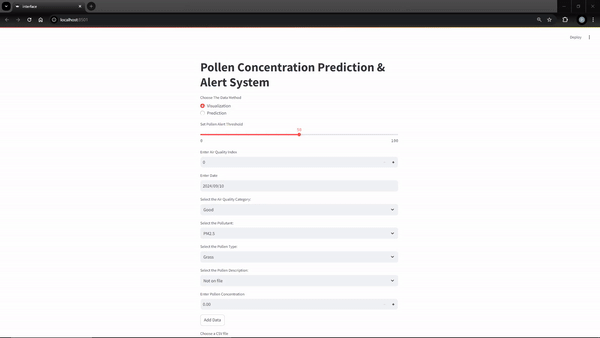
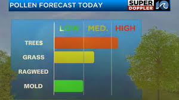
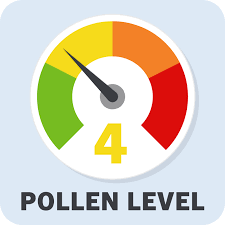

# Pollen Grain Analysis Using AI/ML



## Objective
The goal of this assignment is to develop a machine learning model capable of analyzing data related to pollen grains, predicting pollen concentration, and issuing relevant alerts. The workflow involves multiple stages, starting from problem understanding and data collection to model building and continuous refinement.

---

## Project Overview

### 1. Problem Understanding

### Importance of Analyzing Pollen Grain Data
Pollen concentration has a direct impact on human health, particularly for those suffering from allergies and respiratory issues. By predicting pollen levels, people can take preventive measures, and institutions like hospitals and weather services can issue alerts.

---

### Useful Predictions or Alerts
- **Pollen concentration forecast**: Daily or weekly predictions to help allergy sufferers manage their symptoms.
- **Health risk alerts**: Issuing alerts when pollen levels exceed safe limits, which can inform both individuals and health authorities.
- **Seasonal trends**: Insights into how pollen concentrations change over time, particularly during allergy season.

---


### Images


<!-- Place two images side by side with the same size -->
<div>
    
    
</div>


---

### 2. Data Collection

After extensive research, I identified a relevant dataset: [Air Quality and Pollen Count](https://data.nashville.gov/datasets/804ad841667f46c6998ab8f6e866bff1_0/about).

**Fields:**
- **Air Quality Index**: A unitless measure ranging from 0 to 500 representing air quality.
- **Category**: Descriptive category based on the Air Quality Index reading.
- **Responsible Pollutant**: The pollutant with the highest index.
- **Pollen Count**: Ranges from 0 to 12, representing pollen concentration in the air.
- **Pollen Type**: List of pollen types contributing to the count (e.g., grass, elm, ragweed).
- **Pollen Description**: Detailed description of pollen types.
- **Date**: The date the data was collected.

### 3. Data Preprocessing and Model Training & Validation

Detailed documentation of the data preprocessing and model training steps can be found in the notebook:

```bash
src/task_3_and_4.ipynb
```

or in the file on [drive](https://drive.google.com/file/d/1EVS59jz2fJ0ctNBiTzfNLo5rU9iLnHYj/view?usp=sharing)

Despite thorough efforts, including exploring various approaches and techniques, the dataset's limitations affected the model's accuracy. I employed several strategies to improve the performance:

Boosting Models: Tried XGBoost to enhance predictive capabilities.
Ensemble Methods: Applied techniques like bagging to combine multiple models.
Feature Transformation: Extracted meaningful features from dates, such as weekday, month, and year.
Deep Hyperparameter Tuning: Experimented with different parameters to find the best settings.
Ultimately, while extensive tuning and experimentation were performed, the best results were achieved with Random Forest, which was selected after grid searching various models and parameters.

---
### 4. Prediction & Alert System and  Visualization & User Interface

#### Overview

The Pollen Concentration Prediction System predicts and monitors pollen levels using either manual input or CSV files. It visualizes trends over time and provides alerts when pollen concentrations exceed a user-defined threshold.

#### Features

- **Data Input**: 
  - **Manual Input**: Enter data such as AQI, date, pollen type, etc.
  - **CSV Upload**: Upload a CSV file and select relevant columns for the vizualization method.

- **Prediction**: 
  - Uses a pre-trained model to forecast pollen levels based on one input features.

- **Visualization**: 
  - Displays pollen concentration trends over time using Plotly charts.
  - Color-coded based on whether values exceed the threshold.

- **Alerts**: 
  - Notifies users if pollen levels surpass the set threshold, helping to manage allergies or respiratory conditions.

#### Use Cases

- **Public Health**: Assists individuals in managing exposure to pollen.
- **Agriculture**: Aids farmers in planning around pollen impacts.
- **Research**: Supports studies on the effects of pollen on the environment and health.

This system provides a comprehensive tool for monitoring, predicting, and responding to pollen levels.

you can see the demo [here](https://drive.google.com/file/d/1usHt51sPj5ms8klras6KQCoZGk2bLnIh/view?usp=sharing) or you can run the interface

````bash
cd ./src
streamlit run .\interface.py
````
---
### Continuous Improvement Plan

#### Current Challenges

The model's current performance is limited because the dataset doesn't show strong correlations between features. This makes it difficult to achieve high accuracy with the existing setup.

#### Improvement Strategies

1. **Enhance Data**:
   - **Collect More Data**: Increase dataset size and variety.
   - **Improve Features**: Develop or refine features for better insights.

2. **Model Upgrades**:
   - **Retrain Regularly**: Update the model with new data.
   - **Explore Advanced Techniques**: Test more sophisticated algorithms.

3. **Interface Enhancements**:
   - **Improve Usability**: Make the interface more user-friendly.
   - **Add Features**: Implement error handling and advanced visualizations.

#### Next Steps

With more time, i would focus on:
- **Refining the Model**: Achieve better accuracy with enhanced data and features.
- **Upgrading the Interface**: Enhance usability and add new features based on user feedback.

---
## References
- paper: [What Is Pollen Count](https://www.zyrtec.com/allergy-guide/outdoors/best-times-low-pollen-count#:~:text=Pollen%20counts%20of%2050%20or,to%20how%20severe%20they%20are.)
- paper: [Pollen forecast](https://www.metoffice.gov.uk/weather/warnings-and-advice/seasonal-advice/pollen-forecast#?date=2024-09-08)
- paper: [Pollen Allergies](https://www.metoffice.gov.uk/weather/warnings-and-advice/seasonal-advice/health-wellbeing/pollen/pollen-allergies)
- paper: [F.A.Q About Pollen Forecasting And Sampling](https://www.pollen.com/help/faq)
- paper: [Gauge chart](https://community.plotly.com/t/gauge-chart-with-python/57279/4)
- paper: [line chart](https://plotly.com/python/line-charts/)

